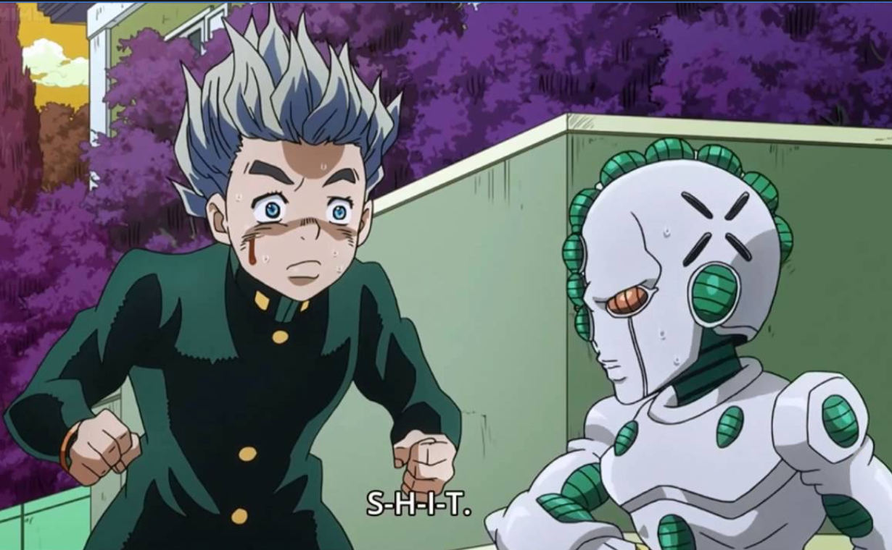

# codewars
#### My crusade to 1 kyu. 

Alright, alright, I find myself かなり下手 as a programmer than I supposed to be. Although I'm about to graduate from gradudate school, my whiteboard coding interviews are often **as miserable as うんこ**. So it's time to make a difference! 

### So here's the plan:

I'll practice **every day** on coding, from simple task to the more sophisticated ones. Originally I thought about the famous (or infamous?🙉) [Leetcode](https://leetcode.com/), but later I think this is mostly focused on algorithm and the language specific tricks are not paid as much attention. Maybe I will finally come back for it but obviously not at this stage (become more fluent in the language itself).

So, after a quick investigation, I decided to use [codewars](https://www.codewars.com/) (another famous coding site) for this purpose.

**Languages:**

C++, Python🐍 and Haskell.

The reason why I choose the above three languages are:

1. They together seem to cover a broad spectrum of programming language paradigms
2. I had most experience with the previous two and really like to learn the third
3. I used/ will use them in study/research/work a lot.

**To become an 1kyu is not a piece of cake (at least for me🙄 ). And it could take long to finally get there. So I made an Achievement-Reward list to encourage me keep going:**

### Achievement Reward List from 9kyu to 1kyu:

Task | Prize
------------|------
C++ upgrade to 7kyu | A 🍔 for me who is currently on a diet
**Overall 7kyu** | Go watch a movie🍿
Any language upgrade to 6kyu | Go to a good seafood🦀 buffet
**Overall 6kyu** | Subscribe 6 month's [red](https://www.codewars.com/subscribe) of codewars
First time 5kyu for any language | Go see a [Kaixinmahua](http://www.kaixinmahua.com.cn/) drama🎭
**Overall 5kyu** | Go to a symphony concert🎶
C++ upgrade to 4kyu | A Tour to museum🎨
**Overall 4kyu** | Buy a book📘 that I always wanted
Python 3kyu | Go to an immersive theatre🎭🎭
**Overall 3kyu** | 温泉♨️旅行に行くんだ‼
Python 2kyu | Buy [AriPods]🎧
C++ 2kyu | Dine [here🥩](http://www.wangsteak.com.cn/) to celebrate
**Overall 2kyu** | Get a cat🐈? Maybe, TBD
**Overall 1kyu** | The end of this stage of journey. Buy [this watch⌚](https://www.citizenwatch.com/us/en/product/NB0046-51L.html?cgid=mens#prefn1=colorFilter&srule=high-low&prefv1=Two-Tone&start=9) as **"kyu belt"**.

**After this, I know there are also 'Dan' (from 1dan to 9dan).** But that would be another story. 

### Check List:
- [ ] C++ upgrade to 7kyu
- [ ] **Overall 7kyu**
- [ ] Any language upgrade to 6kyu
- [ ] **Overall 6kyu**
- [ ] First time 5kyu for any language
- [ ] **Overall 5kyu**
- [ ] C++ upgrade to 4kyu
- [ ] **Overall 4kyu**
- [ ] Python 3kyu
- [ ] **Overall 3kyu**
- [ ] Python 2kyu
- [ ] C++ 2kyu
- [ ] **Overall 2kyu**
- [ ] **Overall 1kyu**
- [ ] 9dan🤪?

---
+ My codewars account is [this](https://www.codewars.com/users/spencerpomme). All activities are transparent.

+ I'll update photos recording the achievements on my instagram account with #codewarschallenge#. I don't know how long this challenge would take but it is really going to be fun.
